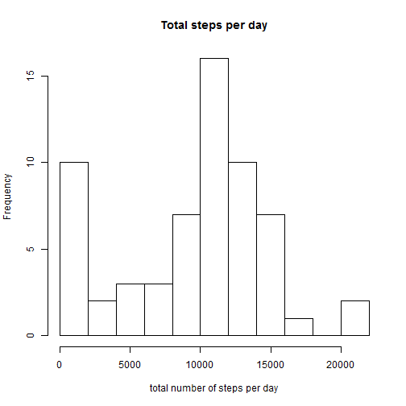
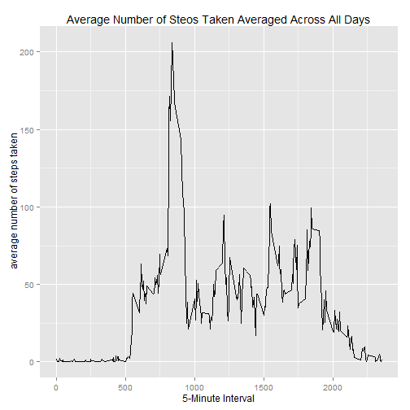
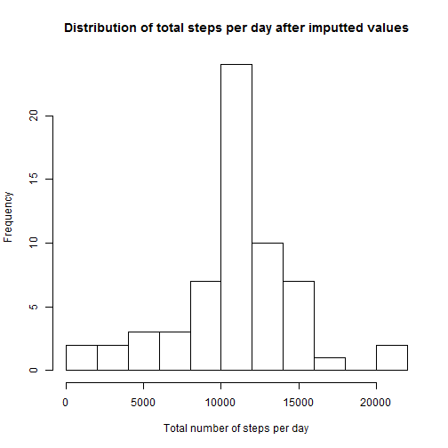
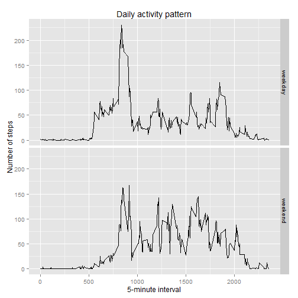

Reproducible Reserach: Peer Assessment 1
===================================================

##Loading and preprocessing the data 

```r
unzip(zipfile="activity.zip")
data<-read.csv("activity.csv")
```


##What is mean total number of steps taken per day?

```r
totalsteps<-tapply(data$steps,data$date,sum,na.rm=TRUE)
hist(totalsteps ,main="Total steps per day",
      breaks=10,xlab="total number of steps per day")
```

 

```r
mean(totalsteps)
```

```
## [1] 9354.23
```

```r
median(totalsteps)
```

```
## [1] 10395
```

##What is the average daily activity pattern?

```r
library(ggplot2)

average<-aggregate(x=list(steps=data$steps),by=list(interval=data$interval),FUN=mean,na.rm=TRUE)

qplot(x=interval,y=steps,data=average, geom="line",
  xlab="5-Minute Interval",
  ylab=" average number of steps taken" ,
 main="Average Number of Steos Taken Averaged Across All Days")
```

 

```r
average[which.max(average$steps),]
```

```
##     interval    steps
## 104      835 206.1698
```

##Inpuing missing values


```r
length(data$steps[is.na(data$steps)])
```

```
## [1] 2304
```

```r
fill<-function(steps,interval)
{
  newframe<-NA
 
  
  if(!is.na(steps))
    newdframe<-c(steps)
  
  else
    newframe<-(average[average$interval==interval,"steps"])
   
  
}

newdata<-data
newdata$steps<-mapply(fill,newdata$steps,newdata$interval)


totalSteps<-tapply(newdata$steps,newdata$date, FUN=sum)


hist(totalSteps,breaks=10,
      xlab="Total number of steps per day",
    
      main="Distribution of total steps per day after imputted values")
```

 

```r
mean(totalSteps)
```

```
## [1] 10766.19
```

```r
median(totalSteps)
```

```
## [1] 10766.19
```

##After there differences in activity patterns between weekdays and weekends?

```r
week<-function(date)

{
  
  day<-weekdays(date)
  
  if (day %in% c("Monday","Tuesday","Wednesday","Thursday","Friday"))
    return("weekday")
  else if(day %in% c("Saturday","Sunday"))
    return("weekend")
  else
    stop("invalid")

}


newdata$date<-as.Date(newdata$date)
newdata$day<-sapply(newdata$date,FUN=week)


averages<-aggregate(steps~interval + day,newdata,mean)


ggplot(averages,aes(interval, steps))+ 
         geom_line()+
         facet_grid(day ~ .)+
         xlab("5-minute interval")+
         ylab("Number of steps") +
         labs(title="Daily activity pattern")
```

 


